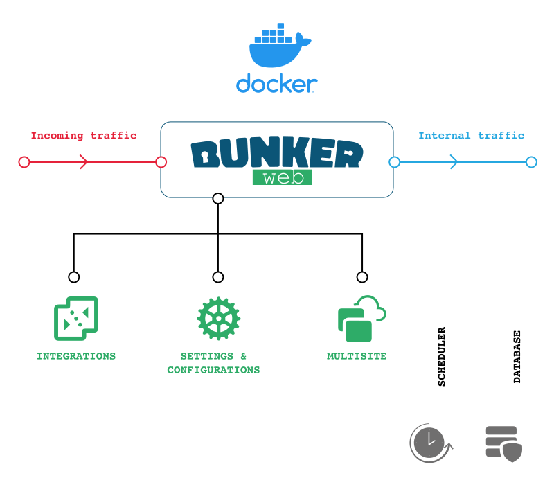
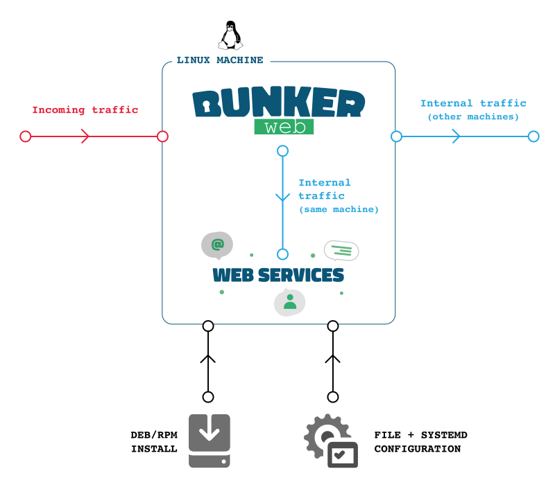

<p align="center">
	
</p>

<p align="center">
	
	
	
	
	
	
	
</p>

<p align="center">
	📓 <a href="https://docs.bunkerweb.io">Documentation</a>
	 &#124; 
	👨‍💻 <a href="https://demo.bunkerweb.io">Demo</a>
	 &#124; 
	🛡️ <a href="https://github.com/bunkerity/bunkerweb/tree/master/examples">Examples</a>
	 &#124; 
	💬 <a href="https://discord.com/invite/fTf46FmtyD">Chat</a>
	 &#124; 
	📝 <a href="https://github.com/bunkerity/bunkerweb/discussions">Forum</a>
	 &#124;
	⚙️ <a href="https://config.bunkerweb.io">Configurator</a>
	 &#124;
	🗺️ <a href="https://threatmap.bunkerweb.io">Threatmap</a>
</p>

> 🛡️ Make security by default great again !

# BunkerWeb

<p align="center">
	
</p>

BunkerWeb is an incredible web server that is built upon the reliable [NGINX](https://nginx.org/) and designed with a primary focus on security.

This web server can effortlessly be integrated into your current environment, whether you're using [Linux](#linux), [Docker](#docker), [Swarm](#swarm), [Kubernetes](#Kubernetes), and more. To ensure that your web services are "secure by default" without any added stress or effort.

With BunkerWeb, you can be assured that all security best practices are applied automatically, and you have total control over each setting to meet your unique needs. The web server comes with a table of primary [security features](#security-tuning) as part of the core, but you can easily expand it with extra features using the [plugin system](#plugins).

Overall, BunkerWeb is a great choice for anyone looking for a secure and user-friendly web server that guarantees optimum performance and uncompromised security for their web services.

## Why BunkerWeb ?

- **Easy integration into existing environments** : support for Linux, Docker, Swarm and Kubernetes
- **Highly customizable** : enable, disable and configure features easily to meet your use case
- **Secure by default** : offers out-of-the-box and hassle-free minimal security for your web services
- **Free as in "freedom"** : licensed under the free [AGPLv3 license](https://www.gnu.org/licenses/agpl-3.0.en.html)

## Security features

A non-exhaustive list of security features :

- **HTTPS** support with transparent **Let's Encrypt** automation.
- **State-of-the-art web security** : HTTP security headers, prevent leaks, TLS hardening, ...
- Integrated **ModSecurity WAF** with the **OWASP Core Rule Set**
- **Automatic ban** of strange behaviors based on HTTP status code
- Apply **connections and requests limit** for clients
- **Block bots** by asking them to solve a **challenge** (e.g. : cookie, javascript, captcha, hCaptcha or reCAPTCHA)
- **Block known bad IPs** with external blacklists and DNSBL
- And much more ...

Learn more about the core security features in the [security tuning](https://docs.bunkerweb.io/latest/security-tuning) section of the documentation.

## Demo

<p align="center">
	
</p>

A demo website protected with BunkerWeb is available at [demo.bunkerweb.io](https://demo.bunkerweb.io). Feel free to visit it and perform some security tests.

# Concepts

<p align="center">
	
</p>

You will find more information about the key concepts of BunkerWeb in the [documentation](https://docs.bunkerweb.io/latest/concepts).

## Integrations

The first concept is the integration of BunkerWeb into the target environment. We prefer to use the word "integration" instead of "installation" because one of the goals of BunkerWeb is to integrate seamlessly into existing environments.

The following integrations are officially supported :

- [Docker](https://docs.bunkerweb.io/latest/integrations/#docker)
- [Docker autoconf](https://docs.bunkerweb.io/latest/integrations/#docker-autoconf)
- [Swarm](https://docs.bunkerweb.io/latest/integrations/#swarm)
- [Kubernetes](https://docs.bunkerweb.io/latest/integrations/#kubernetes)
- [Linux](https://docs.bunkerweb.io/latest/integrations/#linux)
- [Ansible](https://docs.bunkerweb.io/latest/integrations/#ansible)

## Settings

Once BunkerWeb is integrated into your environment, you will need to configure it to serve and protect your web applications.

Configuration of BunkerWeb is done using what we called the "settings" or "variables". Each setting is identified by a name like `AUTO_LETS_ENCRYPT` or `USE_ANTIBOT` for example. You can assign values to the settings to configure BunkerWeb.

Here is a dummy example of a BunkerWeb configuration :

```conf
SERVER_NAME=www.example.com
AUTO_LETS_ENCRYPT=yes
USE_ANTIBOT=captcha
REFERRER_POLICY=no-referrer
USE_MODSECURITY=no
USE_GZIP=yes
USE_BROTLI=no
```

You will find an easy to use settings generator at [config.bunkerweb.io](https://config.bunkerweb.io).

## Multisite mode

The multisite mode is a crucial concept to understand when using BunkerWeb. Because the goal is to protect web applications, we intrinsically inherit the concept of "virtual host" or "vhost" (more info [here](https://en.wikipedia.org/wiki/Virtual_hosting)) which makes it possible to serve multiple web applications from a single (or a cluster of) instance.

By default, the multisite mode of BunkerWeb is disabled which means that only one web application will be served and all the settings will be applied to it. The typical use case is when you have a single application to protect : you don't have to worry about the multisite and the default behavior should be the right one for you.

When multisite mode is enabled, BunkerWeb will serve and protect multiple web applications. Each web application is identified by a unique server name and have its own set of settings. The typical use case is when you have multiple applications to protect and you want to use a single (or a cluster depending of the integration) instance of BunkerWeb.

## Custom configurations

Because meeting all the use cases only using the settings is not an option (even with [external plugins](https://docs.bunkerweb.io/latest/plugins)), you can use custom configurations to solve your specific challenges.

Under the hood, BunkerWeb uses the notorious NGINX web server, that's why you can leverage its configuration system for your specific needs. Custom NGINX configurations can be included in different [contexts](https://docs.nginx.com/nginx/admin-guide/basic-functionality/managing-configuration-files/#contexts) like HTTP or server (all servers and/or specific server block).

Another core component of BunkerWeb is the ModSecurity Web Application Firewall : you can also use custom configurations to fix some false positives or add custom rules for example.

# Setup

## Docker

<p align="center">
	
</p>

We provide ready to use prebuilt images for x64, x86, armv7 and arm64 platforms on [Docker Hub](https://hub.docker.com/r/bunkerity/bunkerweb) using the `bunkerity/bunkerweb` tag.

Usage and configuration of the BunkerWeb container are based on :

- **Environment variables** to configure BunkerWeb and meet your use cases
- **Volume** to cache important data and mount custom configuration files
- **Networks** to expose ports for clients and connect to upstream web services

You will find more information in the [Docker integration section](https://docs.bunkerweb.io/latest/integrations/#docker) of the documentation.

## Docker autoconf

<p align="center">
	
</p>

The downside of using environment variables is that the container needs to be recreated each time there is an update which is not very convenient. To counter that issue, you can use another image called **autoconf** which will listen for Docker events and automatically reconfigure BunkerWeb in real-time without recreating the container.

Instead of defining environment variables for the BunkerWeb container, you simply add **labels** to your web applications containers and the **autoconf** will "automagically" take care of the rest.

You will find more information in the [Docker autoconf section](https://docs.bunkerweb.io/latest/integrations/#docker-autoconf) of the documentation.

## Swarm

<p align="center">
	
</p>

To automatically configure BunkerWeb instances, a special service, called **autoconf**, will be scheduled on a manager node. That service will listen for Docker Swarm events like service creation or deletion and automatically configure the **BunkerWeb instances** in real-time without downtime.

Like the [Docker autoconf integration](#docker-autoconf), configuration for web services is defined using labels starting with the special **bunkerweb.** prefix.

The recommended setup is to schedule the **BunkerWeb service** as a **global service** on all worker nodes and the **autoconf service** as a **single replicated service** on a manager node.

You will find more information in the [Swarm section](https://docs.bunkerweb.io/latest/integrations/#swarm) of the documentation.

## Kubernetes

<p align="center">
	
</p>

The autoconf acts as an [Ingress controller](https://kubernetes.io/docs/concepts/services-networking/ingress-controllers/) and will configure the BunkerWeb instances according to the [Ingress resources](https://kubernetes.io/docs/concepts/services-networking/ingress/). It also monitors other Kubernetes objects like [ConfigMap](https://kubernetes.io/docs/concepts/configuration/configmap/) for custom configurations.

You will find more information in the [Kubernetes section](https://docs.bunkerweb.io/latest/integrations/#kubernetes) of the documentation.

## Linux

<p align="center">
	
</p>

List of supported Linux distros :

- Debian 11 "Bullseye"
- Ubuntu 22.04 "Jammy"
- Fedora 36
- CentOS Stream 8

Repositories of Linux packages for BunkerWeb are available on [PackageCloud](https://packagecloud.io/bunkerity/bunkerweb), they provide a bash script to automatically add and trust the repository (but you can also follow the [manual installation](https://packagecloud.io/bunkerity/bunkerweb/install) instructions if you prefer).

You will find more information in the [Linux section](https://docs.bunkerweb.io/latest/integrations/#linux) of the documentation.

## Ansible

<p align="center">
	
</p>

List of supported Linux distros :

- Debian 11 "Bullseye"
- Ubuntu 22.04 "Jammy"
- Fedora 36
- CentOS Stream 8

[Ansible](https://docs.ansible.com/ansible/latest/index.html) is an IT automation tool. It can configure systems, deploy software, and orchestrate more advanced IT tasks such as continuous deployments or zero downtime rolling updates.

A specific BunkerWeb Ansible role is available on [Ansible Galaxy](https://galaxy.ansible.com/bunkerity/bunkerweb) (source code is available [here](https://github.com/bunkerity/bunkerweb-ansible)).

You will find more information in the [Ansible section](https://docs.bunkerweb.io/latest/integrations/#ansible) of the documentation.

# Quickstart guide

Once you have setup BunkerWeb with the integration of your choice, you can follow the [quickstart guide](https://docs.bunkerweb.io/latest/quickstart-guide/) that will cover the following common use cases :
- Protecting a single HTTP application
- Protecting multiple HTTP application
- Retrieving the real IP of clients when operating behind a load balancer
- Adding custom configurations

# Security tuning

BunkerWeb offers many security features that you can configure with [settings](/settings). Even if the default values of settings ensure a minimal "security by default", we strongly recommend you to tune them. By doing so you will be able to ensure a security level of your choice but also manage false positives.

You will find more information in the [security tuning section](https://docs.bunkerweb.io/latest/security-tuning) of the documentation.

# Settings

To help you tuning BunkerWeb we have made an easy to use settings generator tool available at [config.bunkerweb.io](https://config.bunkerweb.io).

As a general rule when multisite mode is enabled, if you want to apply settings with multisite context to a specific server you will need to add the primary (first) server name as a prefix like `www.example.com_USE_ANTIBOT=captcha` or `myapp.example.com_USE_GZIP=yes` for example.

When settings are considered as "multiple", it means that you can have multiple groups of settings for the same feature by adding numbers as suffix like `REVERSE_PROXY_URL_1=/subdir`, `REVERSE_PROXY_HOST_1=http://myhost1`, `REVERSE_PROXY_URL_2=/anotherdir`, `REVERSE_PROXY_HOST_2=http://myhost2`, ... for example.

Check the [settings section](https://docs.bunkerweb.io/latest/settings) of the documentation to get the full list.

# Web UI

<p align="center">
	<a href="https://www.youtube.com/watch?v=2n4EarhW7-Y" target="_blank"></a>
</p>

The "Web UI" is a web application that helps you manage your BunkerWeb instance using a user-friendly interface instead of the command-line one.

- Start, stop, restart and reload your BunkerWeb instance
- Add, edit and delete settings for your web applications
- Add, edit and delete custom configurations for NGINX and ModSecurity
- Install and uninstall external plugins
- View the logs and search pattern

You will find more information in the [Web UI section](https://docs.bunkerweb.io/latest/web-ui) of the documentation.

# Plugins

BunkerWeb comes with a plugin system to make it possible to easily add new features. Once a plugin is installed, you can manage it using additional settings defined by the plugin.

Here is the list of "official" plugins that we maintain (see the [bunkerweb-plugins](https://github.com/bunkerity/bunkerweb-plugins) repository for more information) :

|      Name      | Version | Description                                                                                                                      |                                                Link                                                 |
| :------------: | :-----: | :------------------------------------------------------------------------------------------------------------------------------- | :-------------------------------------------------------------------------------------------------: |
|   **ClamAV**   |   0.1   | Automatically scans uploaded files with the ClamAV antivirus engine and denies the request when a file is detected as malicious. |     [bunkerweb-plugins/clamav](https://github.com/bunkerity/bunkerweb-plugins/tree/main/clamav)     |
|  **CrowdSec**  |   0.1   | CrowdSec bouncer for BunkerWeb.                                                                                                  |   [bunkerweb-plugins/crowdsec](https://github.com/bunkerity/bunkerweb-plugins/tree/main/crowdsec)   |
|  **Discord**   |   0.1   | Send security notifications to a Discord channel using a Webhook.                                                                |    [bunkerweb-plugins/discord](https://github.com/bunkerity/bunkerweb-plugins/tree/main/discord)    |
|   **Slack**    |   0.1   | Send security notifications to a Slack channel using a Webhook.                                                                  |      [bunkerweb-plugins/slack](https://github.com/bunkerity/bunkerweb-plugins/tree/main/slack)      |
| **VirusTotal** |   0.1   | Automatically scans uploaded files with the VirusTotal API and denies the request when a file is detected as malicious.          | [bunkerweb-plugins/virustotal](https://github.com/bunkerity/bunkerweb-plugins/tree/main/virustotal) |

You will find more information in the [plugins section](https://docs.bunkerweb.io/latest/plugins) of the documentation.

# Support

## Professional

We offer professional services related to BunkerWeb like :

* Consulting
* Support
* Custom development
* Partnership

Please contact us at [contact@bunkerity.com](mailto:contact@bunkerity.com) if you are interested.

## Community

To get free community support you can use the following medias :

* The #help channel of BunkerWeb in the [Discord server](https://discord.com/invite/fTf46FmtyD)
* The help category of [GitHub dicussions](https://github.com/bunkerity/bunkerweb/discussions)
* The [/r/BunkerWeb](https://www.reddit.com/r/BunkerWeb) subreddit
* The [Server Fault](https://serverfault.com/) and [Super User](https://superuser.com/) forums

Please don't use [GitHub issues](https://github.com/bunkerity/bunkerweb/issues) to ask for help, use it only for bug reports and feature requests.

# License

This project is licensed under the terms of the [GNU Affero General Public License (AGPL) version 3](https://github.com/bunkerity/bunkerweb/tree/master/LICENSE.md).

# Contribute

If you would like to contribute to the plugins you can read the [contributing guidelines](https://github.com/bunkerity/bunkerweb/tree/master/CONTRIBUTING.md) to get started.

# Security policy

We take security bugs as serious issues and encourage responsible disclosure, see our [security policy](https://github.com/bunkerity/bunkerweb/tree/master/SECURITY.md) for more information.