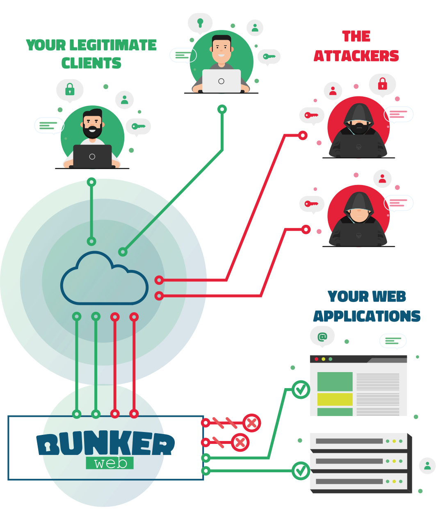

# Introduction

## Overview

<figure markdown>
  { align=center, width="800" }
  <figcaption>Make your web services secure by default !</figcaption>
</figure>

BunkerWeb is a web server based on the notorious [NGINX](https://nginx.org/) and focused on security.

It integrates into existing environments ([Linux](/1.4/integrations/#linux), [Docker](/1.4/integrations/#docker), [Swarm](/1.4/integrations/#swarm), [Kubernetes](/1.4/integrations/#Kubernetes), …) to make your web services "secure by default" without any hassle. The security best practices are automatically applied for you while keeping control of every setting to meet your use case.

BunkerWeb contains primary [security features](/1.4/security-tuning) as part of the core but can be easily extended with additional ones thanks to a [plugin system](/1.4/plugins).

## Why BunkerWeb ?

- **Easy integration into existing environments** : support for Linux, Docker, Swarm and Kubernetes
- **Highly customizable** : enable, disable and configure features easily to meet your use case
- **Secure by default** : offers out-of-the-box and hassle-free minimal security for your web services
- **Free as in "freedom"** : licensed under the free [AGPLv3 license](https://www.gnu.org/licenses/agpl-3.0.en.html)

## Security features

A non-exhaustive list of security features :

- **HTTPS** support with transparent **Let's Encrypt** automation
- **State-of-the-art web security** : HTTP security headers, prevent leaks, TLS hardening, ...
- Integrated **ModSecurity WAF** with the **OWASP Core Rule Set**
- **Automatic ban** of strange behaviors based on HTTP status code
- Apply **connections and requests limit** for clients
- **Block bots** by asking them to solve a **challenge** (e.g. : cookie, javascript, captcha, hCaptcha or reCAPTCHA)
- **Block known bad IPs** with external blacklists and DNSBL
- And much more ...

Learn more about the core security features in the [security tuning](security-tuning) section of the documentation.

## Demo

<figure markdown>
  { align=center }
  <figcaption>Fooling automated tools/scanners</figcaption>
</figure>

A demo website protected with BunkerWeb is available at [demo.bunkerweb.io](https://demo.bunkerweb.io). Feel free to visit it and perform some security tests.
